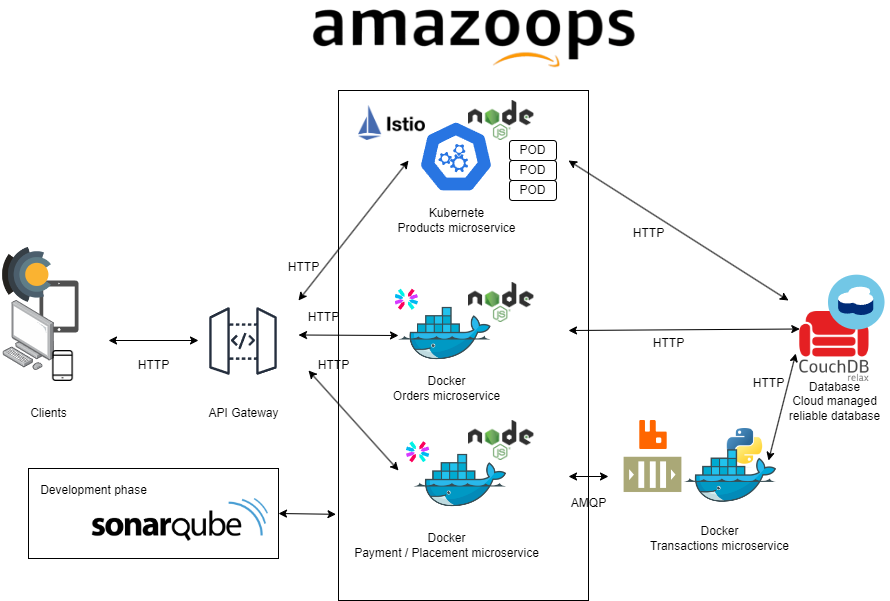

#  amazoops
_Proyecto de Computación Tolerante a fallas_

### Datos
**Alumno:** Ismael Ivan Lopez Murillo

**Materia:** Computación Tolerante a Fallas - Sección D06

**Profesor:** Michel Emanuel Lopez Franco

### Propuesta de proyecto
Se propone la realización de un sistema web de tienda en línea básico que se gestione mediante microservicios y kubernetes para reforzar el despliegue y funcionamiento del sistema, además del uso de mecanismos como istio para la gestión de este, soporte de chaos y otros mecanismos para reforzar la tolerancia a fallas

#### Arquitectura

Esta propuesta de arquitectura utiliza las siguientes herramientas para cubrir los siguientes puntos
- [ ] Node.js: Para la elaboración de microservicios 
- [ ] Python: Para microservicios y demostrar el uso de distintos lenguajes para un mismo sistema
- [ ] Colas de mensajes: Para manejar las carreras de datos y garantizar el mejor manejo de transacciones
- [ ] Kubernetes: Para contener las aplicaciones y gestionar su despliegue y mantenimiento
- [ ] CouchDB / Cloudant: Base de datos gestionada en la nube, para comprobar el posible uso de herramientas gestionadas por un externo, además de garantizar la escalabilidad, replicación y disponibilidad de los datos
- [ ] Istio: Para la gestión y monitoreo de los contenedores
- [ ] Chaos toolkit: Para poner a prueba la tolerancia a fallos del sistema
   